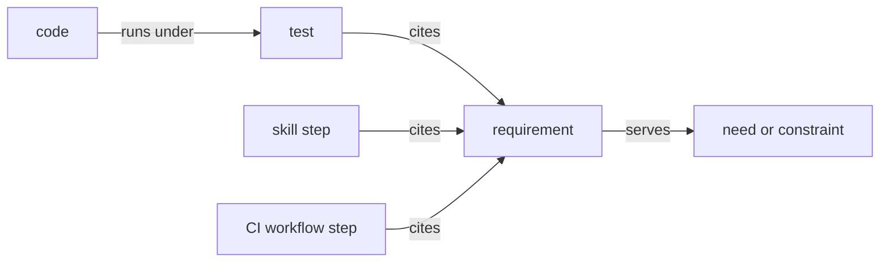

# Needs before code

This file describes a way to record what a codebase is for, and to tie every
behavior in it to that record. It is written for an agent that will adopt the
method in another repository, and for the owner who approves that agent's
work. Its illustrations use a made-up car rental service, and its history
comes from claude-plugins, where the method began.

The method rests on one test. A behavior is justified by a need, which someone
wants, or by a constraint, which the platform forces. A behavior with neither
has no place in the code, however useful it seems.

## The problem

An agent building software fills gaps with guesses. It completes patterns, adds
options a person would have stopped to ask about, and guards against inputs
produced by nothing. Martin Fowler and Kent Beck's catalog of code smells calls
this speculative generality: machinery built for a need that nobody has. Without a
written record of what the code is for, no one can know whether a behavior was
ever asked for. Each later change treats the code as the spec, so one made-up
behavior is built on another.

claude-plugins found this in its issue #114. An agent had given every rule in a
rules file a `source` key with four allowed values. The key passed through each
of these steps unquestioned:

- The key arrived inside a 3,686-line pull request that added a whole plugin,
  too large for review to weigh each behavior in it.
- The format reference then listed the values as part of the format.
- A later issue, written against the code as it stood, required a script to
  write one of them.
- Asked why the key existed, an agent defended it by its symmetry: one value
  for each route a rule could take into the file.

The key was not read by any code, and nothing ever wrote two of its
values. An audit of the repository then found about one behavior in six with
no written need.

Tests did not catch any of it. A test shows that a behavior works, and says
nothing about whether anyone needs it. Several of the unneeded behaviors had
tests, and the lint code that held `source` to its values had no tests.

## The model

The method adds one layer above the code and links everything below it to that
layer.

### Roles

The method names these roles:

- **The owner** decides what the codebase is for, approves work and reviews
  it.
- **The agent** is the AI model doing the work, such as Claude in Claude Code.
- **A contributor** is anyone changing the code (including the agent).
- **The model** is an AI model following written instructions at run time,
  such as Claude following a skill, a file of instructions for one kind of
  task.
  A repository with no such instructions can skip what the method says about
  them.
- **The user** is whoever uses what the codebase ships.

### Needs and constraints

A **need** says who wants what outcome, and why. It takes the situation-first form
of a job story: "When <situation>, <role> wants <outcome>, so <reason>." The
role can open the situation instead, as in "When a renter returns a car, they
want ...". A need comes from a source outside the code, such as the owner's
words, a README, a ticket or a commit message, and cites it.

A **constraint** is a fact about the platform that forces a design, such as "the
fleet vendor's API allows 60 calls a minute". A constraint cites where the fact
is recorded.

### Requirements

A **requirement** is one sentence stating one behavior. EARS, the Easy Approach to
Requirements Syntax from Alistair Mavin and colleagues at Rolls-Royce, opens a
requirement with its trigger: "When <trigger>, <component> <response>." A
requirement here keeps that order whenever the behavior has a trigger. Every
bullet under a need or a constraint is a requirement, so the sentence does not need a
"shall".

Each requirement sits under the need or constraint it serves, and that nesting
is the whole trace from a behavior to its reason. Each also names its kind,
which says what cites it:

- `test`: an automated test cites it.
- `step`: a skill step, meaning a step in the model's instructions, cites it.
- `check`: a CI workflow does it, and the workflow step that does so cites it.
- `eval`: an eval cites it. An eval runs the model's instructions on a set
  task and grades what the model did. This kind is optional.

### The chain

A behavior reaches its reason through a chain. Each arrow reads as a sentence,
from the code up to the need it serves:



A skill step and a CI workflow step carry their citation on the instructions
or the workflow that does the work, so no code sits below them in the chain.
Nothing measures what the model does when it follows a skill step. An eval is
what would close that gap.

A script in CI checks each link on every pull request:

| Link | Checked by | Fails when |
|---|---|---|
| Code runs under a test | The coverage check | A pull request adds a line that no test runs, or a component falls below its coverage floor |
| A test or a skill step cites a requirement | `trace` | One cites nothing, or cites an id that no spec holds |
| Every requirement is cited by something of its kind | `trace` | Nothing of the requirement's kind cites it |
| A requirement serves a need or a constraint | `trace`, as it reads the spec files | A requirement sits outside any need or constraint |

"The checks", below, describes each script.

Coverage is the link most easily left out, and #114 shows why it matters. No
test ran the lint code that held `source` to its values, so no test could cite
a requirement for it, and a trace through tests alone would have passed. The
coverage check forces a test onto new logic, and `trace` forces that test to
cite a requirement.

A script cannot decide whether a need is real, or whether a requirement truly
serves the need it sits under. Those judgments stay with the owner. The chain
turns every behavior into a short line in a spec file. `changes`, under
"Admission", puts each new line in front of the owner, instead of leaving it
in a long diff.

## Script and model in a skill

A skill, or any other instructions a model follows at run time, splits its
work between the model and a script written for it. The split holds whether
the repository runs the skill on itself or ships it to users.

The script does the deterministic work, meaning the work where two runs on the
same input should give the same answer:

- parsing
- selecting files
- diffing
- validating
- reading config
- writing results

The model does only what needs judgment, such as inferring a rule, writing
prose or deciding whether something conforms. It also calls the tools that a
script cannot reach.

A seam is a point where the model stands between one command's output and the
next command. A skill keeps a seam only where a judgment or such a tool call
has to sit between two commands, and one command does the work everywhere
else. That gives the skill the fewest seams its work allows.

Every seam is one of these kinds:

- **Judgment.** The model decides something, or relays the user's decision,
  and the next command takes the decision as input. In the car rental
  service, `rentals quote` prints a token, a short hash of the price the
  renter was shown, and `rentals hold` refuses to reserve a car without it.
  The token carries the renter's approval across the seam.
- **Platform.** The model calls a tool that a script cannot reach, such as one
  that asks the user a question or writes to the user's computer.
- **Courier.** The model does work a script could do, in one of these ways:
  - it carries a value from one command's output into the next, unchanged
  - it chooses what to do from an exit code, by a table in its instructions
  - it verifies something a command could verify itself
  - it edits a file by a rule

A courier seam costs context on every run, and it is a place the model can go
wrong. The script does that work instead, under these rules:

- A step runs one command for its deterministic work. A second command comes
  only after a judgment or a platform seam.
- A command that stops says what to do next, so the instructions need not map
  exit codes to remedies.
- The model hands the script its changes as data, such as JSON, and the script
  checks them and writes them. The model does not edit a file by hand where a
  script could.
- Small commands stay small inside the script. A step's command composes them,
  and tests reach each one. What moves is the composing, from the model to the
  script.

claude-plugins' skills had courier seams when this method was written. One
skill linted two files and listed both, and its next command read both again.
Another had the model format each new rule by hand from a 210-line reference
and then lint it. A skill that ran 7 commands in 888 words when it landed ran
11 in 2,078 words a few weeks later.

## The spec files

Specs live in a `specs/` folder at the repository root, with one file per
component and `specs/repo.md` for what the whole repository shares. Keep the
folder out of anything that ships.

A spec file looks like this:

```markdown
# rentals

This file records what the rentals service is for.

## Out of scope

- Selling cars. The service only rents them.
- Setting prices, which the pricing service owns.

## need user-checks-each-charge: Check each charge on a returned car

When a renter returns a car, they want every charge listed on the receipt, so
they can check each one against the agreement they signed.

Source: the product brief, under "Receipts".

- `close-cmd-lists-each-charge` (test): When `rentals close` ends a
  rental, it prints one line per charge, with its amount and its reason.
- `close-cmd-shows-late-fee` (test): When the car comes back after the
  agreed time, the receipt shows the late fee on a line of its own.

## need user-books-in-one-sitting: Book a car in one sitting

When a renter books through the booking skill, they want every open question
asked at once, so the booking takes a single exchange.

Source: ticket #12.

- `booking-asks-in-one-batch` (step): When a booking has open questions, the
  booking skill puts all of them to the renter in one batch.

## constraint fleet-allows-60-calls: The fleet API allows 60 calls a minute

The fleet vendor's API refuses any call over that limit, so a sync that sends
more loses updates.

Source: the fleet vendor's API reference, under "Rate limits".

- `sync-cmd-stays-under-limit` (test): When `rentals sync` updates the
  fleet, it sends at most 60 requests in any one minute.
```

### Grammar

A script can parse a spec file line by line. Its grammar, written in EBNF
(extended Backus-Naur form, a notation for the shape of a text), is:

```ebnf
spec         ::= title intro? out-of-scope section*
title        ::= "# " component
out-of-scope ::= "## Out of scope" item+
item         ::= "- " text
section      ::= need | constraint
need         ::= "## need " id ": " heading-text story source requirement*
constraint   ::= "## constraint " id ": " heading-text fact source requirement*
source       ::= "Source: " text
requirement  ::= "- `" id "` (" kind "): " text continuation*
continuation ::= indent text
kind         ::= "test" | "step" | "check" | "eval"
id           ::= word "-" word ( "-" word )? ( "-" word )? ( "-" word )?
word         ::= [a-z0-9]+
```

How to read the notation:

- `?` marks a part that may be left out.
- `*` marks a part that may repeat, or be absent.
- `+` marks a part that appears at least once.
- `|` separates choices.
- Quoted text appears as written.
- A name with no rule of its own, such as `text` or `story`, stands for free
  text.

The grammar leaves out blank lines, and the line breaks inside a paragraph.

`trace` reads the `need`, `constraint`, `requirement`, `continuation`, `kind`
and `id` parts, and fails a spec file that breaks them. How it reads them:

- Any `##` heading ends the section above it. A heading that is not a need
  or a constraint (including a misspelled one) does not open a section, so a
  requirement under it fails as one outside any need.
- Under a need or a constraint, every bullet must be a requirement.
- A continuation line is indented, and follows its requirement without a blank
  line between.
- It checks every need, constraint and requirement id against the form
  under "Ids", below.
- In claude-plugins it refuses `eval`, since nothing there runs an eval yet.

The rest is convention, which the owner reviews:

- the title and the intro
- the out-of-scope items
- the job story and the `Source:` line
- the shape of each requirement's sentence

"Needs and constraints" and "Requirements", above, give the templates for the
job story and the sentence.

The rules the grammar cannot show:

- An "Out of scope" section comes first. It lists what the component
  deliberately does not do, so an agent can see that a feature is unwanted
  before building it. Each item names the thing that is out of scope, such as
  "Selling cars". An item written as a negative, such as "No sales", can read
  as though the absence were what the section rules out.
- A need's paragraph says who wants what and why. A constraint's paragraph
  states the fact and what it forces. The `Source:` line under either says
  where it is recorded.
- An id says what it means. A report can then name
  `close-cmd-shows-late-fee` and be checked without opening the file. An
  id keeps its name when its sentence is reworded.
- Ids are unique within a file. A requirement in `specs/repo.md` is named from
  another file as `repo:<id>`.
- A requirement that goes is deleted. Version control keeps what it said.

### Ids

An id reads as a short sentence whose subject comes first, so a reader can
tell which word is the verb. `claim-shows` reads as "the claim shows" or as
"claim the shows". `close-cmd-shows-late-fee` has one reading.

Word 1 is the subject, in one word:

- A need's id opens with the role that wants the outcome, one of those under
  "Roles": `user-checks-each-charge`. A need whose story names two roles
  picks one. The id uses the role even when the story calls the person
  something else: a renter and an author both appear as `user`.
- A constraint's id opens with the platform thing the fact is about:
  `fleet-allows-60-calls`.
- A requirement's id opens with its actor, which is a command, a file, a
  workflow or a skill. A command of two words gives its last word, so
  `rentals close` gives `close`.
- A command's name, singular or plural, takes the marker `cmd` after it,
  so a reader can tell the command from a file or a skill of the same name:
  `sync-cmd-stays-under-limit`, `reports-cmd-lists-open-rentals`.
  A script run as a whole is a command too.
- `command` is an ordinary word, which the marker does not claim. It can be
  the subject of a requirement about every command, as in
  `command-splits-output-streams-without-json`, and it cannot stand in for
  `cmd`.
- A name of several words is joined into one, so a `booking-assistant` skill
  gives `bookingassistant` and `CLAUDE.md` gives `claudemd`.

The verb comes next, as word 2, or as word 3 after `cmd`. It is in the
present tense and ends in `s`. It can instead be `can`, `cannot`, `may` or
`must`, followed by the verb, as in `sync-cmd-cannot-exceed-limit`. It
can also be `never` or `only`, followed by a verb ending in `s`, as in
`close-cmd-never-drops-charges`. Choose a verb that cannot also be read
as a noun: `claim-labels` reads as "the claim's labels" as easily as "claim adds a
label", so `claim-cmd-adds-label` is clearer.

An id has two to six words, not counting `cmd`.

The words after the verb name what the requirement covers, and no more.
`report-cmd-refuses-insertions` names a class wider than the empty spans its
requirement refuses. A finding whose replacement is longer than its text
inserts too, and `apply` accepts it, so a report that names the id claims a
refusal that the code does not make. `report-cmd-refuses-empty-spans` names
only what the requirement refuses.

When its sentence makes the behavior hold only with an option the user
passes, or only without it, the id names the option, as
`command-splits-output-streams-without-json` and
`write-cmd-writes-nothing-unless-partial` do. An id that names the option in
other words is enough: `-in-preview` names `--dry-run`. A required option is
an input that every run passes, so the id leaves it out. The rest of a
condition, such as a fallback or the state of the files, stays in the
sentence.

`trace` checks the rest of this section, and cannot check these two rules.
Only a reader who holds the id against its sentence can tell whether the id
covers more, or leaves out an option the behavior turns on, so the rules
take judgment. The agent applies them when naming a requirement, and the
owner when reviewing one.

## Citing requirements

A test cites the requirements it verifies with a tag its runner can read. In
pytest, that is a marker:

```python
@pytest.mark.spec("close-cmd-shows-late-fee")
def test_late_return_adds_a_late_fee_line(rental): ...
```

Register the marker, and run pytest with `--strict-markers`, so a misspelled
marker fails. Other test runners have tags of their own, and `trace` only has
to read them.

A skill step cites its requirements in a comment on its own line under the
step's heading. A skill step that runs more than one command also says which
kind of seam sits between them:

```markdown
## Step 2: ask the open questions
<!-- spec: booking-asks-in-one-batch -->
<!-- seam: platform: the renter answers through the question tool -->
```

A comment on a line of its own does not show when the markdown is rendered.
Whether the model reads it depends on the tool that loads the instructions,
since some tools strip such comments first. Check that tool before assuming
the markers won't add to the context.

A CI workflow step cites its requirements in a comment above the step's
`- name:` line, with only comment lines between:

```yaml
# spec: ci-runs-lint
- name: Lint
  run: ruff check .
```

Code does not cite requirements. The tests that run the code do, and coverage
connects the two.

## The checks

Each check is a subcommand of a script that CI runs on every pull request, and
fails the pull request when it finds a problem. `inventory`, the first below,
is the exception: it is a report, run by hand. Build the scripts the way the
repository builds its other checks. In claude-plugins that means
standard-library Python, JSON output on request, and exit codes of 0 for clean,
1 for problems found and 2 for could not run.

- **`inventory`** lists what needs tracing in one component. It is the input to
  adopting the method in an existing codebase, and a report the owner can read.
  It lists:
  - every command, option and allowed value the component's command-line parser
    accepts, with the instruction text that names each
  - every module-level collection of strings, such as a set of allowed values
  - every test, with the lines it runs
  - every step in the model's instructions, with the commands it runs
  - every line not run by any test
- **`trace`** fails when it finds any of these:
  - a test or a skill step that does not cite a requirement
  - a citation of an id that does not exist in a spec
  - a requirement that nothing of its kind cites
  - an id not in the form "Ids" gives
- **`surface`** fails a command, option or allowed value that is not named by a
  requirement. A command-line parser, a route table and a configuration schema
  are each a registry a script can list, and each can be held to this rule.
- **`changes`** fails a pull request whose description does not list every
  requirement its diff adds, changes or removes. It also fails one that adds a
  need or a constraint its linked ticket does not name.
- **The seam check** fails a skill step that runs more than one command
  without a `<!-- seam: <kind>: <reason> -->` marker.
- **The coverage check** fails when a component's branch coverage, which counts
  both sides of each `if`, drops below its floor. It also fails a pull request
  that adds a line that is not run by any test. A floor starts at the
  component's figure on the day it is set, and only rises. A deliberate
  exception carries a comment with its reason, such as `# pragma: no cover` in
  Python.

Notes for the agent that builds them:

- A check that scans nothing fails. A file pattern that stops matching would
  otherwise pass every pull request.
- Per-test coverage is what ties a line to a test. In Python, pytest-cov, the
  pytest plugin for the coverage.py tool, records it with
  `--cov-context=test`. coverage.py's own per-test mode recognizes only test
  functions whose names start with `test`.
- A check starts as a warning. An item it flags waits on a list keyed to the
  ticket that will fix it, and passes with a warning while that ticket is
  open. The list only shrinks, and an entry whose ticket has closed fails.
- `changes` has to allow for agents that post under the owner's account. Such
  an agent can edit a ticket after the owner approves it, so the check also
  fails when a linked ticket's text changed after its approval.

## Rules for agents

Put these rules where the agent reads them in every session. That is CLAUDE.md
for Claude, or AGENTS.md for a tool that reads that file instead.

```markdown
- Build only what a requirement in `specs/` asks for. Before adding a
  command, option, key, value, refusal or branch, find the requirement it
  serves.
- A behavior is justified by a need, which someone wants, or by a
  constraint, which the platform forces. Symmetry, completeness and "it
  might be useful" are neither.
- When no requirement covers what the work needs, stop. Propose the
  requirement, and the need or constraint it serves, in the ticket or the
  pull request, and wait for the owner.
- Asked why a behavior exists, answer with its requirement and its need. If
  it has none, say so and file a ticket. Do not argue for it from the
  design's own consistency.
- Put the model between two commands only at a judgment or a platform seam.
  Everywhere else, the script does the joining.
```

A rule the agent reads is a request, and a check the agent can edit is a weak
control. The owner's approval of a ticket is the control to keep out of the
agent's reach, so admission to the spec rides on it. Where agents post under
the owner's account, guard it as claude-plugins does: a hook stops the agent
adding the approval label, and CI refuses work on a ticket that lacks it.

## Admission

A new need or constraint is the decision that matters most, so it enters the
spec only through the owner. Either one justifies a behavior, so a constraint
an agent made up would let in a behavior that nobody asked for.

- A new need or constraint is named in the approved ticket that adds it.
- A new requirement under an existing need or constraint is listed in the pull
  request, where the owner reviews it.
- A ticket carries a "Requirements" field for the ids it adds, changes or
  removes, or the id a bug breaks. Approving the ticket then approves those
  lines explicitly.

`changes`, under "The checks", fails a pull request that leaves a new need
or constraint out of its linked ticket, or a changed requirement out of its description.

claude-plugins' issue #103 showed the failure this prevents. An agent wrote the
issue against the code as it stood, so its "Done when" required the script to
write `source=adopted`. Approving the idea approved the key, and nobody saw it
happen.

## Adopting it

### A new codebase

Write the spec with the first feature. Add the rules for agents, the spec
folder with its out-of-scope list and its first needs, and `trace` and the
coverage check as errors from the start. A new codebase has nothing to sift.

### An existing codebase

Specifying existing code has one trap. An agent reading the code finds a reason
for everything in it, and a spec written that way records the guesses as
requirements. So the needs come from outside the code, and the owner rules on
whatever the agent cannot place. Take one component at a time:

1. **Freeze.** Add the rules for agents, and run `trace` as a warning, so new
   work arrives traced while the old work is sifted.
2. **Inventory.** Run `inventory` on the component, and post its output on the
   component's ticket. Coverage measures the component's scripts, and not the
   files it copies into a project, such as shell scripts it renders from
   templates. Read those by hand for behavior that no test runs. Where
   `inventory` does not reach a component, build the same sections from its
   parser and a coverage run measured per test, and post the commands with the
   output. claude-plugins' own tooling was listed that way (#135, #253).
3. **Needs.** Draft the needs and constraints from sources outside the code:
   the README, the descriptions of the model's instructions, design notes,
   platform notes, tickets and commit messages. Cite the source of each. The
   owner confirms the list before anything is matched to it.
4. **Seams.** Label each seam in the model's instructions as judgment, platform
   or courier. Post the labels on the ticket. A courier seam goes on the
   ruling list as a merge, since the seam check accepts only a judgment or a
   platform marker.
5. **Placing.** Match each inventory item to a confirmed need or constraint,
   and write its requirement. The question depends on the kind of item:

| Item | Question | With no good answer |
|---|---|---|
| Command or option | Which skill step, README instruction or documented procedure passes it? | Remove it, or wire it into a skill step if the need is real |
| Value accepted | What writes it? | Stop accepting it |
| Data written or printed | What reads it to decide something? | Stop writing it |
| Refusal or guard | Can a real caller reach it, and what harm does it prevent? | Remove it |
| Limit or number | Where does the number come from: a probe, a platform document, or the owner? | Probe it, or ask the owner |
| Instruction | Would the model act differently without it? | Cut it |
| Seam between commands | Is there a judgment or a platform tool in it? | Merge it into the script |
| Test | Which requirement does it verify? | It goes with the behavior it tests |
| Untested code | Is it part of an unneeded behavior, required error handling, or a real case with no test? Can any input reach it? | Remove it, keep it, or add a test. Code that no input reaches gets a ticket of its own |

An item is placed only under a need that has a source. "The code does it" is
not a source.

6. **Ruling.** Post on the ticket every item that could not be placed, as a
   numbered list, each with its evidence and a recommended outcome. The owner
   rules on all of them in one reply. The outcomes:
   - **Remove:** nothing calls it, and no need asks for it.
   - **Keep:** the owner states the need, in words that become its heading.
   - **Wire up:** the need is real and nothing uses the behavior, so a ticket
     adds the step that uses it.
   - **Fix:** the need is real and the behavior is wrong.
   - **Probe:** the behavior claims a platform limit that nothing has measured.
   - **Merge:** the item is a courier seam, and its work moves into the
     script.
7. **Pull requests.** The spec pull request does not change any behavior. It
   adds the component's needs and requirements, cites them from the tests and
   skill steps that stay, and lists every pending ruling with its ticket. Every
   other ruling gets a ticket and a small pull request of its own, which changes
   the code, its tests, its docs and its instructions together.
8. **Switch.** When the backfill's spec pull request lands, its checks become
   errors for everything but the items still on the list, each keyed to its
   ruling's ticket. An entry whose ticket has closed fails, so the list
   empties as the rulings land.

These rules hold throughout:

- Merges land before the requirement lines for the commands they touch.
  Requirements about what the user gets can come first, because reshaping the
  commands leaves them standing.
- A test goes only with the behavior it tests. A duplicate test is not a
  target, since deleting a test whose requirement remains can lose an edge
  case.
- Data a project stores is the exception to removal. The code stops writing it
  and keeps accepting it, so existing files still work.
- When removing a behavior breaks a test other than its own, the behavior had a
  caller the inventory missed. Stop, and ask the owner again.
- A test that checks a kept behavior, and also asserts something a ruling
  removes, cites the kept behavior's requirement. The ruling's pull request
  edits the assertion. A test of the ruled behavior alone stays on the list of
  untraced items, keyed to the ruling's ticket.
- Every requirement needs something of its kind that cites it. When a kept
  behavior has no test, the spec pull request adds one. A test does not change
  behavior.
- A behavior that follows a convention of the whole repository, such as how
  every script prints its output, gets its requirement in `specs/repo.md`.
  The component's tests cite it as `repo:<id>`.
- Before filing a ticket for a ruling, search the open tickets, and comment on
  a match instead. A recommendation with a condition, such as "keep if a
  folder can hold several projects", can be settled either way by the owner's
  answer. The ticket that follows says how it read the answer.
- An approval that leaves a condition open does not settle it. When the owner
  approves "keep if X, and remove otherwise" without saying whether X holds,
  ask which, before filing its ticket. An approved "keep, if you state the
  need" is a keep. The spec pull request words that need from the reason on
  the ruling list, and lists the wording for the owner to correct.
- Record on the ticket how the ruling was read, one line per item that was
  not a plain yes, before filing the tickets that follow from it.

### Order of work

In an existing codebase, the work goes in this order:

1. The rules for agents, with the seam rule if the repository has model
   instructions.
2. The spec folder, its grammar and the ticket's "Requirements" field.
3. The coverage floor.
4. `inventory` and `trace`, as warnings.
5. A pilot on the smallest component. What it teaches goes back into this
   method before the rest.
6. The other components, one at a time.
7. Every check as an error, with `surface` and `changes` added.

claude-plugins files each of these as its own issue, #126 to #136.

## Keeping it light

Spec-driven tools, where an agent writes a spec before it writes code, have
drawn criticism the method is built to avoid:

- **Volume.** Long generated specs are harder to review than the code they
  describe. Here a behavior is one line, and nothing writes a document per
  feature.
- **Guessing.** Some tools tell the model to guess where a spec is unclear, and
  to record the guess as an assumption. Here a guess goes to the owner as an
  unplaced item, and stays out of the spec.
- **Stale specs.** A spec written after the fact goes stale. Here a
  requirement that nothing of its kind cites fails `trace`.
- **False control.** An agent can ignore a spec it only reads. Here CI checks
  each link, and admission rides on the owner's approval.

## Growing it

The method grows with the codebase without changing shape:

- **More components** each get a spec file.
- **More registries** join `surface`: routes, configuration keys, public
  functions, and anything else a script can list.
- **Coverage per requirement** comes from joining per-test coverage with the
  tests' citations. Code that only uncited tests reach is behavior that no
  requirement asked for.
- **The model's half** can move from step markers to evals.
- **More owners** each confirm the needs in their own components. A CODEOWNERS
  file, which GitHub reads to request reviewers by path, routes each spec
  change to the right one.

## Schemes considered

This section records, at the owner's request, the schemes weighed and set
aside before this one was chosen, so a new reader can see why the method looks
as it does.

### Use cases

A use case, in Alistair Cockburn's sense, describes how someone reaches a goal
through a system. It names:

- the actor
- the trigger
- the main flow
- the situations that change it
- what stays true when it fails

A use case states a need well, and this method keeps that part. A need heading
carries the outcome. Requirements that open with "When" carry the situations.
The out-of-scope list comes from the same habit.

As the unit a test cites, a use case is too coarse. Many behaviors can cite one
broad use case, so a new behavior can arrive without adding a line to the spec,
and the owner never sees it.

### Executable examples

Behavior-driven development writes each behavior as a scenario, in the form
Given a starting state, When something happens, Then an outcome. Each scenario
runs as a test, or as an eval for the model's half. Scenarios cannot drift from
the code, and this method keeps that part too: the tests are its examples, and
evals can verify the model's half later.

A scenario states what happens, and never whether anyone wants it. A scenario
for an unneeded behavior passes every check, and the only statement of need
sits at the top of a feature, shared by all its scenarios. Evals also cost money
and minutes on every run, which makes them a poor gate for every change.

### Adopting a spec-driven tool whole

Tools such as OpenSpec and GitHub Spec Kit have an agent write a spec before
the code. Each brings its own record of change, such as a proposal folder per
change or a spec, a plan and a task list per feature. A repository that already
records change in tickets, with approval before work starts, would keep two
records that drift apart. This method borrows their formats, such as
requirements with scenarios and lists of what a change adds and removes, and
keeps the ticket as the only record of change.

## Sources

- Martin Fowler, with Kent Beck, *Refactoring* (1999), chapter 3, for
  speculative generality.
- Alistair Mavin, Philip Wilkinson, Adrian Harwood and Mark Novak, "Easy
  Approach to Requirements Syntax (EARS)", RE'09,
  [doi:10.1109/RE.2009.9](https://doi.org/10.1109/RE.2009.9).
- Birgitta Böckeler,
  [Understanding spec-driven development: Kiro, spec-kit and Tessl](https://martinfowler.com/articles/exploring-gen-ai/sdd-3-tools.html),
  2025.
- claude-plugins: [#114](https://github.com/ScottHysom/claude-plugins/issues/114),
  where the method starts, and #126 to #136, which adopt it here.
